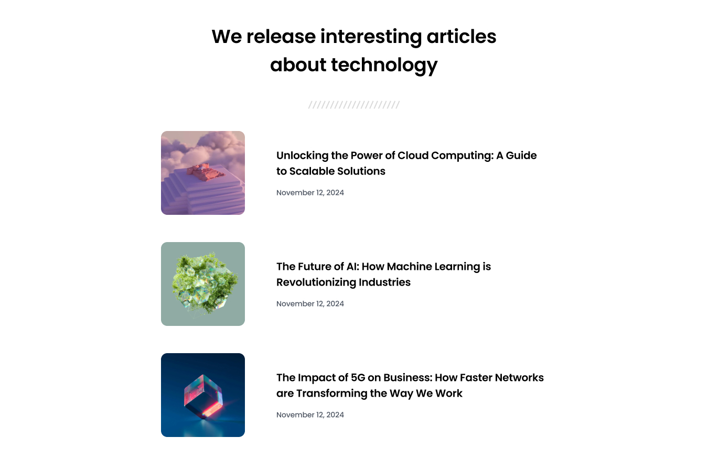

# Simple Article Listing

## Welcome! 👋

- [GitHub Url](https://github.com/sukanyagurav/Dev-Challenges/tree/main/meet_the_team_section)
- [Netlify](https://simplearticles5867.netlify.app/)

## Overview
Welcome to my project! My goal with this project is to build a solid understanding of HTML and CSS while working on a practical and visually appealing article listing.

### Meet the team section Desktop View

    <h2> Tech stack used</h2>

 

## User stories

✅ Create a responsive web page that displays a list of articles using HTML and CSS.

✅ Each article should include a picture, title, and publication date.

✅ Implement flexbox to create a visually appealing and responsive layout for the article listing.

✅ Apply clean spacing and typography to enhance the overall design.

✅ Test the web page on different devices and screen sizes to ensure responsiveness.
